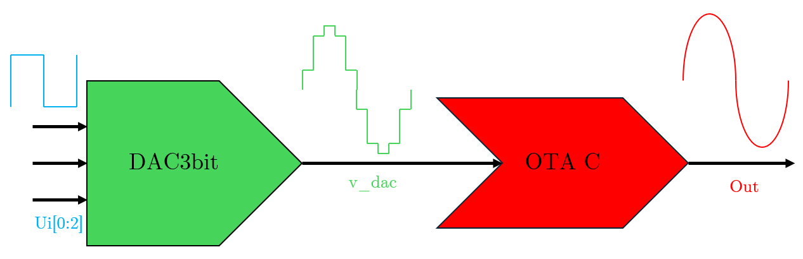
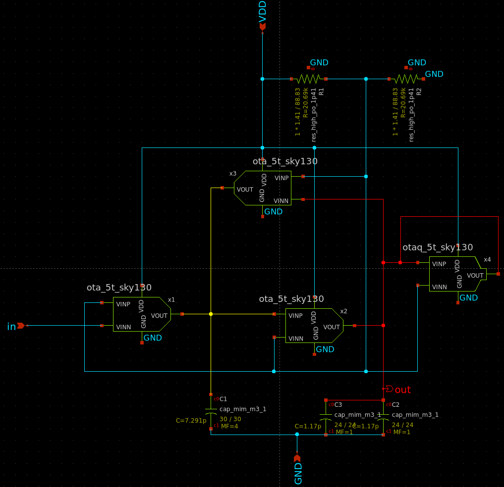
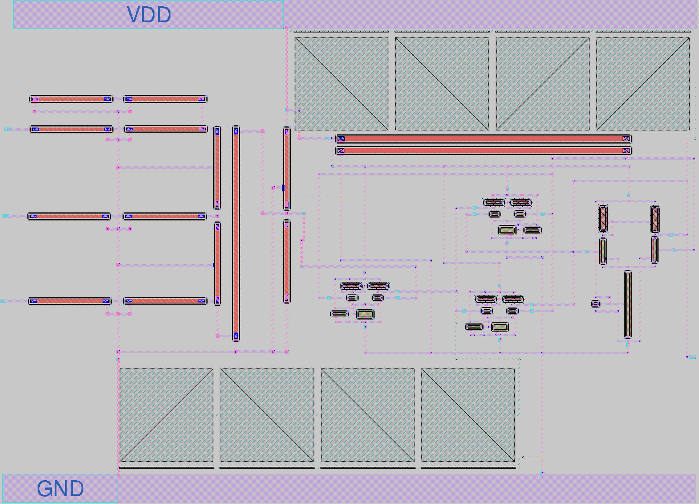
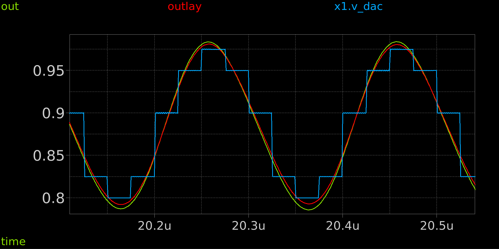
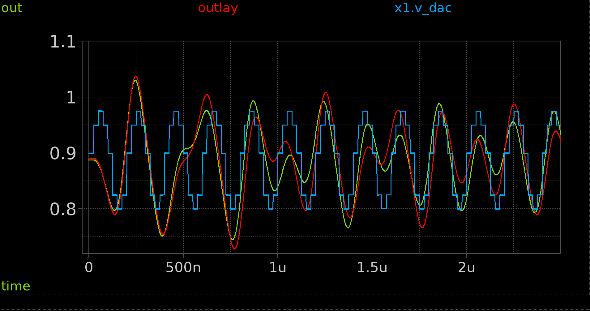
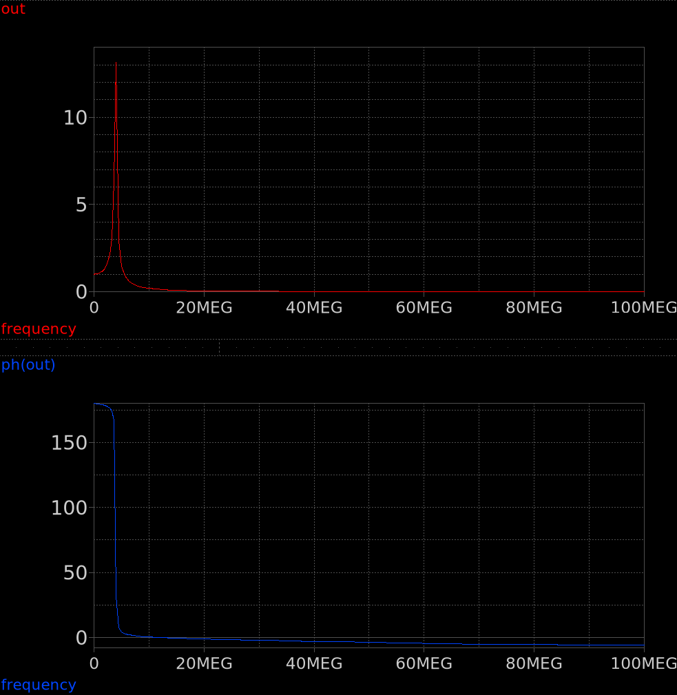
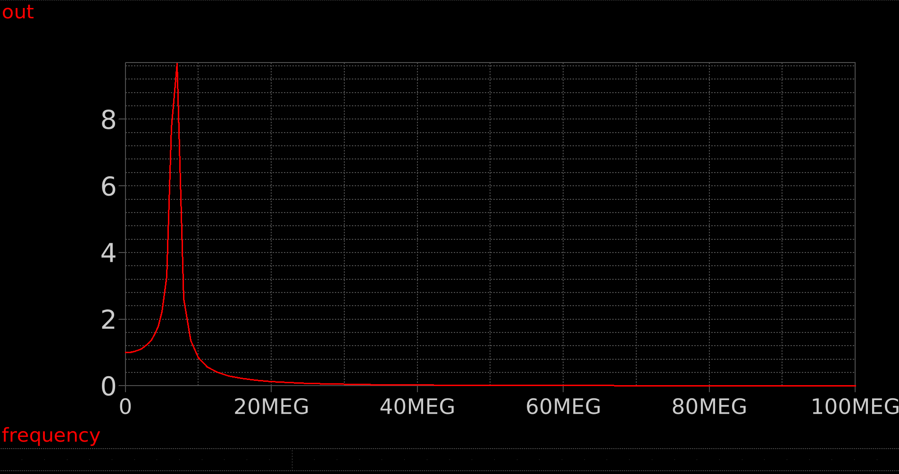
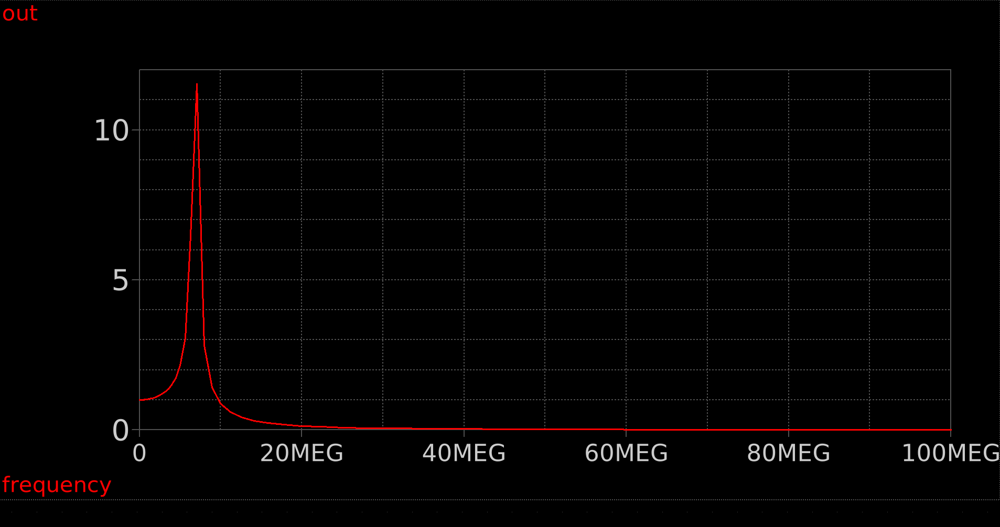

 

# Regenerative OTA-C Q-Boosted Filter in SKY130A 130nm

## Abstract

This project implements a second-order regenerative OTA-C filter that smooths the staircase output of an on-chip 3-bit R-2R DAC into a continuous, sine-like waveform. The filter is built from four self-biased 5-transistor OTAs arranged in a classic two-integrator-loop biquad, with an additional OTA cell wired in positive feedback on itself to act as a negative resistance and boost the loop's quality factor Q. Schematic-level simulation (ngspice, Sky130A tt corner) confirmed correct staircase reconstruction of a 5MHz sine wave signal (with 0dB gain), a resonant peak around 3.5MHz with Q more than 15, and unity (0dB) DC gain. The full layout has been completed in Magic and is LVS-clean, with parasitic extraction (PEX) available for post-layout verification.

## Architecture

1) R-2R DAC (3-bit) binary-weighted resistor ladder (sky130_fd_pr__res_generic_po unit resistors), driven directly by the digital ui[0:2] pins at full 0–1.8V swing. No switches needed: the digital drivers themselves provide the rail-to-rail switching. A Resistive attenuator scales the DAC's full-scale output (up to 1.575V) down to the OTA's linear input range (around 0.225V total swing, centered near the filter's common-mode voltage), using a series + shunt resistor network sized by superposition.

2) OTA C Block: OTA1 / OTA2 / OTA3 (ota_5t_sky130 x1, x2, x3) are three identical self-biased 5-transistor OTAs (NMOS differential pair + PMOS current-mirror load + NMOS tail current source) forming the classic two-integrator-loop Gm-C. C1 and C2 are on-chip MiM capacitors (metal3, 2fF/µm², split into a parallel array of unit cells to stay within the 30µm max single-cap dimension). OTA_Q (otaq_5t_sky130 x4): a smaller, low-current variant of the same 5T OTA topology, connected in positive feedback on its own input/output node, producing a negative resistance in parallel with the lossy filter node to boost Q. Inside the OTA C block, there is also a VCM generator: a low-current resistive divider (VDD/2, sky130_fd_pr__res_high_po, 319Ω/sq) providing the ≈0.9V common-mode reference shared by all OTAs.

## Implementation

1) PDK: SkyWater SKY130A (sky130_fd_pr primitive devices: nfet_01v8, pfet_01v8, res_generic_po, res_high_po, cap_mim_m3_1).
2) Schematic capture and  simulation: xschem + ngspice.
3) Layout: Magic VLSI layout tool, using the Sky130 device generators (gencells) for all primitive devices (transistors, poly/xhigh-poly resistors, MiM capacitors) to guarantee DRC-correct geometry.
4) Verification: DRC and LVS (layout vs. schematic) in Magic/netgen all blocks pass LVS. Parasitic extraction (PEX) performed for post-layout re-simulation in ngspice.
5) Bias generation: fully self-biased, no external analog bias pins. Main OTAs use a fixed-VGS tail device (gate tied to VDD, channel length tuned to set the target tail current) instead of a resistor-based current reference, minimizing static power. The VCM reference is a low-current (µA-range) resistive divider.
6) DAC architecture choice: R-2R was chosen over a resistor-free charge-redistribution DAC for simplicity, since resistors were already required elsewhere in the design (VCM divider, input attenuator).
7) Q-boosting: the classic "regenerative" technique (same principle as Armstrong's regenerative radio receiver) an OTA in positive feedback presents a negative small-signal resistance that partially cancels the parasitic output conductance of the main resonant loop, raising Q without adding a separate high-Q passive component.
8) Sizing methodology: device W/L and bias currents were derived using the gm/ID method, cross-checked against simulated gm/gds at the actual DC operating point.

All parameters are collected in this table:

| Parameter | Target | Obtained Value (tt corner) |
|---|---|---|
| F0 | 3.5 MHz | ≈3.4 MHz |
| Q | ~20  | ≈19 |
| GainDC | 1 (0 dB) | 1 (0 dB) |
| PowerSupply | 1.8 V | 1.8 V |
| Total Current (static) | ~124 µA (3×40µA OTA mains + ~4µA OTA_Q) | ~125 µA |
| Available Output Swing | — | ~0.4V–1.6V |
| Risoluzione DAC | 3 bit (8 levels) | 3 bit (8 levels) |
| Technology | SkyWater Sky130A 130nm | SkyWater Sky130A 130nm |

Lastly, in the next table is summeraized how the OTAs' transistors' size have been designed, including their gm and gds:

| Transistor | Role | ID (µA) | W/L (µm/µm) | gm/ID (V⁻¹) | gm measured (µS) | gds measured (µS) |
|---|---|---|---|---|---|---|
| M1 (OTA1) | input (diff. couple) | 20 | 2/0.5 | ~10 | 181.9 (x1) | 1.89 (nfet) |
| M1 (OTA3) | ingresso (diff. couple) | 20 | 2/0.5 | ~10 | 183.9 (x3) | 1.74 (nfet, x3.xm2) |
| M2 (OTA2 at output) | output (diff. couple) | 20 | 2/0.5 | ~10 | 186 (x2) | 1.90 (nfet, x2.xm2) |
| M3/M4 (PMOS mirror, OTA1-3) | active load | 20 | 5/0.5 | — | — | 1.69–1.73 (pfet) |
| M5 (coda, OTA1-3) | currwnt source | 40 (total) | L=1.475 | — | — | — |
| M1/M2 (OTA_Q) | Q-boost (diff. couple) | 2×0.15 | W=0.5, L=7 | ~19.4 | 2.99 | — |
| M2/M4 (OTA_Q at output) | Q-boost load | — | — | — | — | nfet 0.0074, pfet 0.0016 |

The Q factor is related to the Gain parameter with the equation:

$|H(j\omega)| = K \cdot Q$

With K as GainDC (dB). This formula can be re-written to get the value of Q factor:

$Q = 10^{\frac{(Gain_{max} - Gain_{DC})}{20}}$

Since the system's purpose is to regenerate a sine wave like signal from a staircase sine wave like one with the constraint of the output dynamic range (0.4V to 1.6V), and more importantly there is no need to amplify the output signal, for all frequency >> 4MHz it has been chosen to not get a Q factor > 25. In fact, around the reasonance peak frequency, the output signal is highly distorted by the dynamic range constraint, so it is raccomanded to not work at this frequency.  

## Simulation results

1) Transient (staircase reconstruction): driving the R-2R DAC with an 8-level code sequence approximating a sampled sine wave, the schematic-level filter output reconstructs a smooth, continuous waveform with the staircase steps fully removed.

2) AC response: a clear resonant peak is visible near fo, with the expected 180° total phase rotation through resonance, confirming genuine complex-conjugate pole behavior.

3) Post-layout (PEX): parasitic-extracted netlist available; post-layout vs. pre-layout comparison.

Where OUT is the system's time response from the schematic while on the other hand OUTLAY is the system's time response from post-layout. Finally, x1.v_dac is the output of the DAC3bit.

Where OUT is the system's time response from the schematic while on the other hand OUTLAY is the system's time response from post-layout. Finally, x1.v_dac is the output of the DAC3bit.

4) PVT simulations have been successfully shown that the circuit works correctly in all corners conditions ("tt", "ff", "ss", "sf") but the "fs" one (using VDD = 1.8V at 27°C), showing major OUTLAY signal distortion (faster positive swing and slower negative swing of the sine wave). For the Voltage Source variations (1.8V ± 10%) in combination with Temperature variations (-40°C, +27°C, +125°C), the 9 possible simulations shows high distortion for the case (1.62V ; -40°C) in post-layout simulation in particular, while the rest of them highlight minor changes on DC value and amplitude of the sine wave.

5) A Monte Carlo analysis was executed: 100 AC simulations have been launched to track down F0, Q and Gain in tt_mm corner conditions. Since it was necessary to check the difference between pre-layout and post-layout performances, the main testbench has been edited this way: at b0 DAC3bit input is wired a ac small signal source (at DC value of around 0.9V) while b1 and b2 have a fixed DC value of 0.9V (half scale). The results are illustrated in the next table:

| Parameter | Pre-Layout | Post-Layout |
|---|---|---|
|  F0  | 3.4481 MHz, σ = 100kHz  | 3.3891 MHz, σ = 85kHz |
|  Q   |   19.5635, σ = 0.670974 | 20.2404, σ = 0.567021 |
|GainDC| -37.4929 dB, σ = 1.01135 dB | -36.1004 dB, σ = 0.775899 dB|
|GainF0| -11.6691 dB, σ = 0.764473 dB| -9.97938 dB, σ = 0.590153 dB|

6) It was also studied separatly and verified that the presence of the OTA_Q introduces little to none variations at the working frequency (5MHz): the main focus of the system is to regenerate correctly the analog frequency of the staircaise input signal, possibly without amplification. On the other hand, its design can be modified for future developments in order to achieve better Q factor values and therefore better Gain values.

## How it works

This project reconstructs a smooth analog waveform from a coarse digital staircase, using a second-order regenerative OTA-C filter.

1. 3-bit R-2R DAC

A classic binary-weighted R-2R resistor ladder (res_generic_po unit resistors, sized for good ratio matching) converts the 3-bit digital code on ui[0:2] into 8 analog voltage levels (0 to VDD·7/8 ≈ 1.575V).

Since the OTA input stage only stays linear over a differential range of a few tens of mV, the full-scale ladder output is passed through a resistive attenuator (series + shunt resistors) that compresses the 8 steps down to roughly 0.225V of total swing, centered around ≈ 0.89375V inside the linear input range of the filter, while preserving the relative spacing between codes.

2. Regenerative OTA-C filter

The scaled staircase drives a second-order Gm-C filter built from four identical 5-transistor OTAs (single differential pair + PMOS current-mirror load + NMOS tail current source, fully self-biased on-chip and no external bias pin):

OTA1, OTA2: the two Gm-C integrators of the classic two-integrator-loop biquad (C1, C2 on-chip MiM capacitors).

OTA3: closes the resonant feedback loop between the two integrator nodes, setting the pole frequency together with C1/C2.

OTA_Q: a smaller, low-current OTA connected in positive feedback on itself (output tied to its own non-inverting input). This creates a negative resistance in parallel with the lossy output node, cancelling most of the parasitic output conductance of the loop and boosting the filter's Q this is the "regenerative" part of the design.

The net effect: the sharp steps of the DAC staircase are smoothed into a continuous sine-like waveform at the output, with the resonance tuned close to the input signal's frequency for maximum smoothing with minimal ripple.

An on-chip resistive divider (VDD/2, sized for low static current) generates the common-mode reference (VCM ≈ 0.9V) used by all four OTAs, no external bias voltage is required.

3. Power

Main VDD is used (1.8V).

## How to test

Drive ui[0], ui[1], ui[2] with a 3-bit code sequence that approximates a sine wave when passed through the DAC at a fixed sample rate to trace out one period, repeating to build up multiple cycles (F0 to reconstruct must be ≥ 4.5MHz in order to not break the output dynamic constraints).

Probe ua[0] with an oscilloscope.
You should see a smooth, continuous waveform tracking the average shape of the input staircase, with the sharp steps filtered out. Increasing/decreasing the code update rate relative to the filter's resonant frequency changes how much smoothing you observe.

Leaving the code static lets you check the DC operating point and confirm the DAC + attenuator sit inside the filter's linear input range (~0.89375V ± 0.1V at the filter input).

## External hardware

None required. Is recommended to use an oscilloscope to observe ua[0], while any digital source can drive ui[0:2].

## References

- SkyWater SKY130 PDK: https://skywater-pdk.readthedocs.io/
- TinyTapeout: https://tinytapeout.com/
- IIC-OSIC-TOOLS: https://github.com/iic-jku/IIC-OSIC-TOOLS]
- R. Geiger, E. Sanchez-Sinencio, "Active Filter Design Using Operational Transconductance Amplifiers: A Tutorial," IEEE Circuits and Devices Magazine, 1985
- R. Schaumann, H. Xiao, M. Van Valkenburg, "Design of Analog Filters," Oxford University Press
